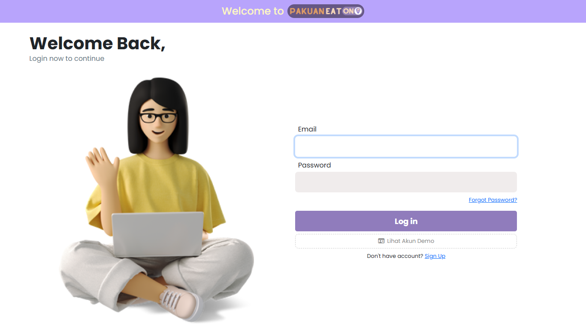
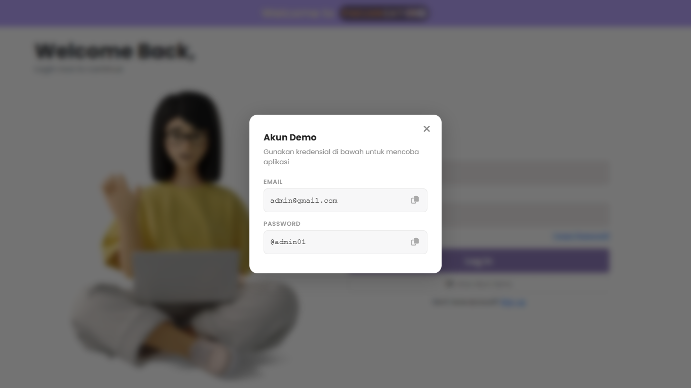
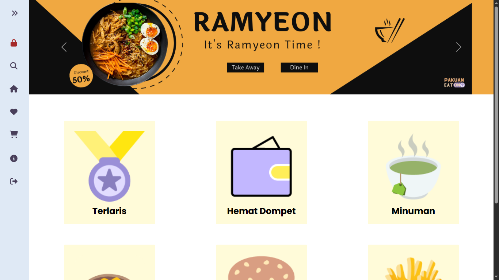
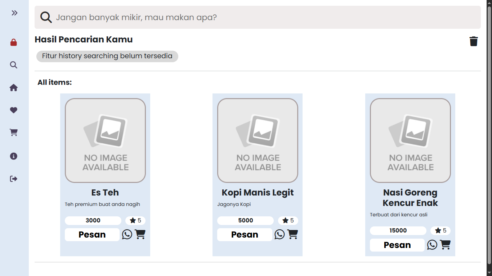
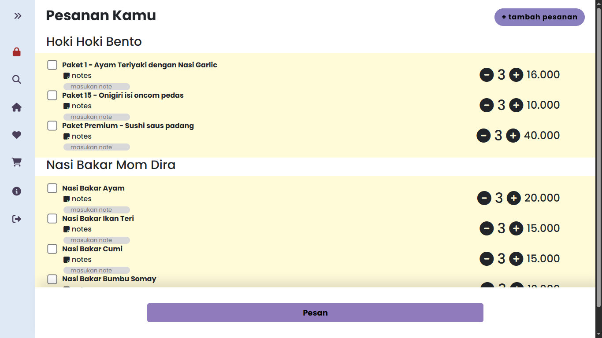
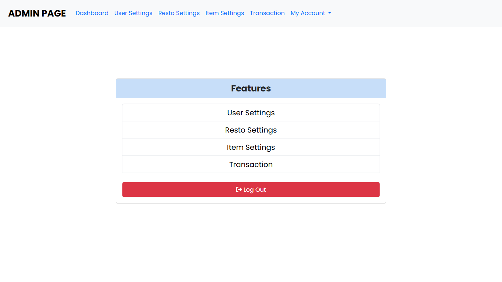
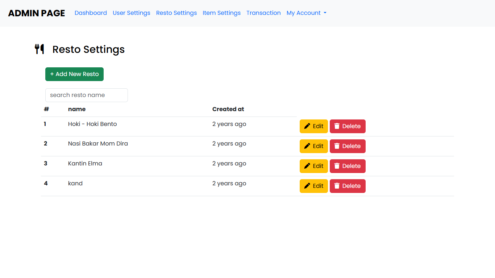

# Pakuan — Eat-On

Aplikasi pemesanan makanan sederhana (Laravel) untuk demo dan pengembangan lokal.

**License**: [MIT License](https://github.com/bayufadayan/pakuan.eat-on/blob/master/LICENSE)
 
## Public Demo
<p>
  <a href="http://pakuan-eaton.free.nf/">
    
  </a>
</p>

## Requirements
- **PHP:**: 8.0+
- **Composer:**: latest
- **Node.js & npm:**: 16+ / npm
- **Database:**: MySQL atau MariaDB

## Screenshots
Berikut beberapa screenshot dari permainan:









## Quick Setup
- **Install dependencies:**
```bash
composer install
npm install
```

- **Copy environment file:**
```bash
# PowerShell
cp .env.example .env
# or (Linux/macOS)
cp .env.example .env
```

- **Set environment variables:**
  - Update `DB_CONNECTION`, `DB_HOST`, `DB_PORT`, `DB_DATABASE`, `DB_USERNAME`, `DB_PASSWORD` di file `.env`.

- **Generate app key:**
```bash
php artisan key:generate
```

- **Migrate & seed database:**
```bash
php artisan migrate --seed
```

- **Build / watch frontend assets:**
```bash
# Development (watch)
npm run dev
# Production build
npm run build
```

- **Run the app (local):**
```bash
php artisan serve
# default: http://127.0.0.1:8000
```

**Testing**
- **Run tests:**
```bash
php artisan test
# or
vendor/bin/phpunit
```

**Important Files**
- **Routes:**: [routes/web.php](routes/web.php)
- **Models:**: [app/Models](app/Models)
- **Views:**: [resources/views](resources/views)
- **Migrations:**: [database/migrations](database/migrations)

**Common Commands**
- **Clear cache:**: `php artisan optimize:clear`
- **Run queues:**: `php artisan queue:work`
- **Seed only:**: `php artisan db:seed`

**Contributing**
- Fork the repo, buat branch feature, buka pull request. Jaga commit kecil dan deskriptif.
